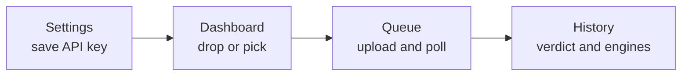

<p align="center">
  
</p>

<h1 align="center">Sentinel</h1>

<p align="center">
  <strong>Desktop client for <a href="https://www.virustotal.com/">VirusTotal</a> API v3.</strong><br>
  Drop files or folders, watch the queue, keep a local history of verdicts.
</p>

<p align="center">
  <a href="LICENSE"></a>
  
  
  
  
</p>

<p align="center">
  <a href="#quick-start">Quick start</a> ·
  <a href="#usage">Usage</a> ·
  <a href="#privacy">Privacy</a> ·
  <a href="#develop">Develop</a> ·
  <a href="CONTRIBUTING.md">Contributing</a> ·
  <a href="CHANGELOG.md">Changelog</a>
</p>

---

Sentinel is **not** a local antivirus. It submits samples to VirusTotal and shows the returned verdicts. Native I/O, OS keychain, HTTP, tray, and window chrome live in Rust; the UI is React.

Maintained by [NemoKing](https://github.com/NemoKing1210) · [NemoKing1210/Sentinel](https://github.com/NemoKing1210/Sentinel)

## Features

|                 |                                                                                                                                                                                     |
| --------------- | ----------------------------------------------------------------------------------------------------------------------------------------------------------------------------------- |
| **Scan**        | Files and folders via picker or drag-and-drop. Folders are zipped locally, then uploaded as one archive (VirusTotal cap: **650 MB**). Files over 32 MB use the upload-URL endpoint. |
| **Queue**       | Live upload → scan → retry. Clear finished items when you are done.                                                                                                                 |
| **History**     | Local reports with engine results and a link to the VirusTotal GUI.                                                                                                                 |
| **Secrets**     | API key lives in the OS keychain only — never in `localStorage` or `state.json`.                                                                                                    |
| **Desktop**     | Native menu, system tray, single-instance focus, close-to-tray.                                                                                                                     |
| **Preferences** | Theme, accent, language, polling interval, structured logs (rotated, 30-day retention).                                                                                             |

UI languages: English, Russian, Spanish, German, French, Portuguese, Chinese.

## Quick start

**Requirements:** Node.js 20+, Rust 1.77+ (stable), a [Tauri 2 desktop toolchain](https://v2.tauri.app/start/prerequisites/), and a [VirusTotal API key](https://docs.virustotal.com/docs/please-give-me-an-api-key).

```bash
git clone https://github.com/NemoKing1210/Sentinel.git
cd Sentinel
npm install
npm run tauri dev
```

> [!IMPORTANT]
> Use `npm run tauri dev` for the real app. `npm run dev` is the Vite UI on port **1421** only — dialogs, keychain, scans, tray, and persistence will not work there.

Packaged binary:

```bash
npm run tauri build
```

## Usage



1. Open **Settings**, paste a VirusTotal API key. Sentinel probes the API, then stores the key in the OS keychain (`sentinel-virustotal` / `api-key`).
2. On the **Dashboard**, drop files, pick files, or pick a folder.
3. Watch progress on **Queue**. Completed scans land in **History**.
4. Open the VirusTotal report from a history card when you need the full engine table in the browser.

## Privacy

> [!WARNING]
> Every scan **sends file contents (or a ZIP of a folder) and hashes to VirusTotal**. Treat that as a third-party disclosure.

| Data                                    | Where it goes                                                 |
| --------------------------------------- | ------------------------------------------------------------- |
| API key                                 | OS keychain only                                              |
| Queue, history, settings, window bounds | App data dir as `state.json` — the key is never written there |
| Logs                                    | App log dir, `sentinel-YYYY-MM-DD.log` — do not log secrets   |

## Develop

| Command                                            | What it does                     |
| -------------------------------------------------- | -------------------------------- |
| `npm run tauri dev`                                | Desktop app with native commands |
| `npm run dev`                                      | Vite UI only (port `1421`)       |
| `npm run lint`                                     | ESLint                           |
| `npm run format:check`                             | Prettier                         |
| `npm run build`                                    | `tsc` + Vite production bundle   |
| `cargo check --manifest-path src-tauri/Cargo.toml` | Native compile check             |
| `npm run tauri build`                              | Packaged installer / binary      |

Before a pull request, run `npm run build` and `cargo check --manifest-path src-tauri/Cargo.toml`.

<details>
<summary><strong>Stack</strong></summary>

| Layer   | Technology                                                   |
| ------- | ------------------------------------------------------------ |
| Shell   | Tauri 2                                                      |
| UI      | React 19, TypeScript, custom CSS, Heroicons — no Material UI |
| State   | Zustand                                                      |
| i18n    | i18next (`en`, `ru`, `es`, `de`, `fr`, `pt`, `zh`)           |
| Native  | Rust (`commands`, `persistence`, `logging`, `chrome`)        |
| Network | `reqwest` → VirusTotal API v3                                |

Presentational widgets live in `src/components/ui/`.

</details>

<details>
<summary><strong>Project layout</strong></summary>

```
src/                 React application
  app/               constants, hooks, pure helpers
  components/        reusable UI and window chrome
  core/              types, native API, store, i18n, persistence, logging
  features/          dashboard, queue, history, settings
  styles/            global primitives and theme
src-tauri/src/       native commands and app bootstrap
```

Architecture for contributors and coding agents: [AGENTS.md](AGENTS.md). Claude Code session brief: [CLAUDE.md](CLAUDE.md). Human workflow: [CONTRIBUTING.md](CONTRIBUTING.md).

</details>

## License

[MIT](LICENSE) · [Issues](https://github.com/NemoKing1210/Sentinel/issues) · [NemoKing](https://github.com/NemoKing1210)
